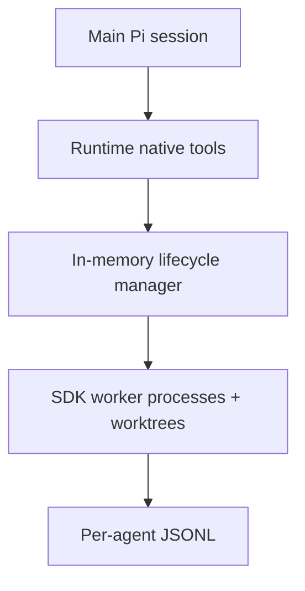
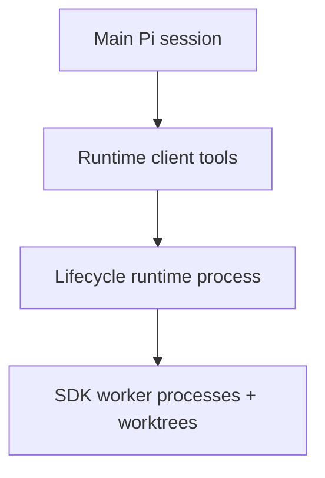

# Hall SDK worktree runtime

## Token ledger

| Case                          | System (est.) | Tool schemas (est.) | Tool calls (est.) | Tool results (est.) | Context after | Provider input/output | Wall time |
| ----------------------------- | ------------: | ------------------: | ----------------: | ------------------: | ------------: | --------------------: | --------: |
| Fabric                        |           763 |                 251 |                19 |                  65 |         1,037 |            2,837 / 96 |   9.827 s |
| SDK                           |           350 |                 151 |                73 |                  65 |         1,050 |           1,905 / 106 |   9.276 s |
| SDK native Discussion comment |           796 |                  86 |                26 |                  83 |           940 |              924 / 16 |   7.030 s |

Estimates are serialized model-facing content ÷ 4. Context after is Pi `getContextUsage().tokens` after settlement. SDK case: [Discussion #445](https://github.com/MockaSort-Studio/hall-of-automata-cli/discussions/445).

SDK native Discussion comment: disposable Discussion #450; `github_discussion_post` extension call; 1,702 ms tool duration; marker externally verified, then the Discussion and worktree were deleted.

## Runtime design

### Current implementation

- One agent is one fresh worktree and one standalone Pi SDK process.
- The worker owns its `AgentSession`, selected tools/extensions, and telemetry.
- The lifecycle manager is currently in Main's runtime extension and is intentionally in-memory.
- Agents run in parallel; delete stops the process and removes its worktree.

### Next boundary

Move the lifecycle manager into its own process without changing its four operations: `spawn`, `list`, `inspect`, `delete`.

### Next subsystem: communication

Communication is separate from lifecycle. It will provide typed messages between Main and workers; lifecycle remains responsible only for worker lifetime.

## Source map

| Concern                                                | Source                                                                                                 |
| ------------------------------------------------------ | ------------------------------------------------------------------------------------------------------ |
| Main-facing lifecycle tools                            | [.pi/extensions/runtime/index.ts](../../.pi/extensions/runtime/index.ts)                               |
| Current lifecycle manager and worktree/process control | [.pi/extensions/runtime/lib/runtime.mjs](../../.pi/extensions/runtime/lib/runtime.mjs)                 |
| SDK worker and JSONL telemetry                         | [.pi/extensions/runtime/lib/worker.mjs](../../.pi/extensions/runtime/lib/worker.mjs)                   |
| Named tool bundles                                     | [.pi/extensions/runtime/lib/tool-bundles.mjs](../../.pi/extensions/runtime/lib/tool-bundles.mjs)       |
| Native Discussion tools                                | [.pi/extensions/github/lib/discussions/tools.ts](../../.pi/extensions/github/lib/discussions/tools.ts) |

## Observability

Write per-run and per-agent JSONL outside model context:

- run/agent start, end, exit, error, elapsed time;
- model and thinking level;
- provider input/output/reasoning/cache usage;
- context before/after;
- system prompt and tool-schema estimates;
- tool name, source (native/extension/custom), call/result estimates, duration, outcome.

No raw prompts or tool output by default.

## Plan

1. Build one SDK runner: fresh worktree, one bounded task, final status, JSONL telemetry.
2. Build Lifecycle spawn/list/delete around that runner.
3. Run two SDK agents in parallel; verify independent worktrees, logs, and deletion cleanup.
4. Add future concerns separately: durability, communication, sandboxing.
