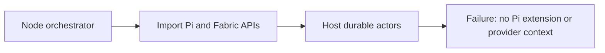
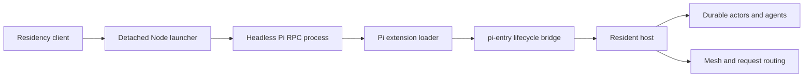
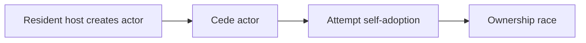
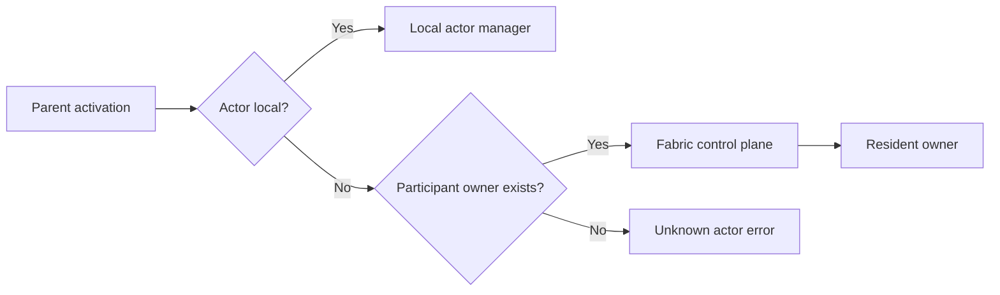
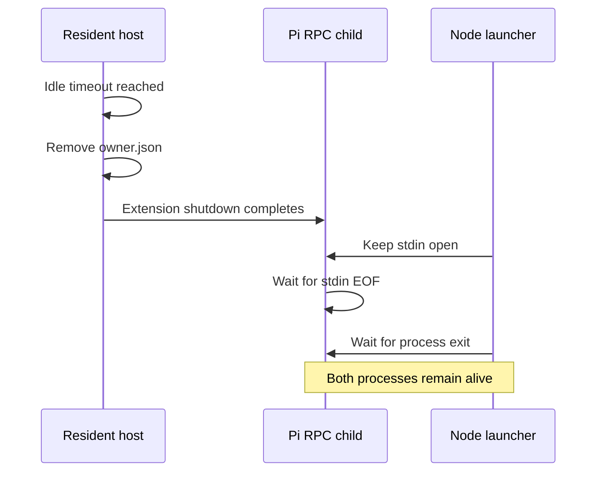
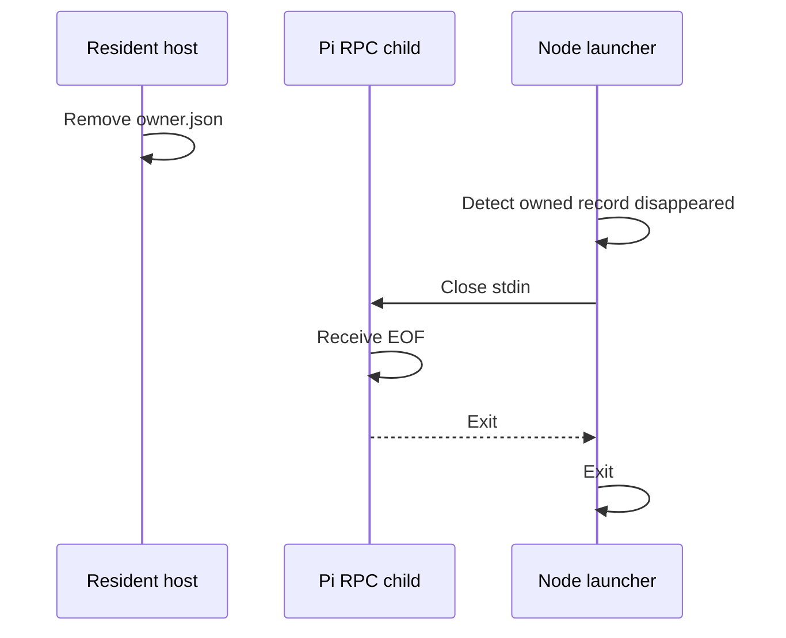

### Summary

While implementing a durable multi-agent Crew, we found three related issues:

1. Durable residency cannot run as a plain Node service.
2. Nested durable actors lose ownership and routing across activations.
3. The launcher and Pi RPC child survive resident idle shutdown.

Implementation: https://github.com/MockaSort-Studio/pi-fabric/tree/dev

### 1. Node runtime versus Pi runtime

Fabric providers and Pi core packages belong to the Pi runtime. A raw Node process cannot act as the resident Fabric host or reliably resolve Pi's host-provided peers.



Implemented topology:



Responsibilities:

- **Node launcher:** process supervision only.
- **Pi runtime:** extension loading and provider ownership.
- **`pi-entry.js`:** Pi lifecycle to resident-host bridge.
- **Resident host:** actors, requests, mesh routing, ownership, and idle exit.

The durable interface remains `config.json`, `owner.json`, request/response files, and mesh state.

Implemented in [`122c9e9`](https://github.com/MockaSort-Studio/pi-fabric/commit/122c9e9499d12426ad93b7d676ec7ac35ba5e9ac).

### 2. Nested durable actor failures

Observed errors:

```text
Fabric actor registry is owned by another host
Root resident host exited while creating durable actor
Unknown Fabric actor: <actorId>
```

Previous ownership path:



Corrected routing:



Implemented changes:

- Removed create → cede → self-adopt.
- Added `ResidentActorClient`.
- Added resident `createActor` and `removeActor`.
- Centralized local/remote actor resolution.
- Routed remote ask/tell through participant ownership.
- Preserved unknown-target errors when no owner exists.

### 3. Launcher idle leak

After actor removal, `owner.json` disappeared and resident idle shutdown completed, but the launcher and Pi RPC child remained alive.



Corrected lifecycle:



Implemented in [`3d14aaa`](https://github.com/MockaSort-Studio/pi-fabric/commit/3d14aaafd2c412c38e37e139b4f6a510bb7158f8).

Additional behavior:

- Ownership requires `owner.pid === child.pid`.
- Duplicate startup children receive stdin EOF.
- Stale or dead owner PIDs are ignored.

### Verification

- TypeScript checks passed.
- Agent-provider tests: **63/63**.
- Residency and launcher tests: **12/12**.
- Build and artifact assertions passed.
- Concurrent nested durable creation passed.
- Cross-activation ask, tell, status, steer, follow-up, publish, and remove passed.
- Live idle probe ended with zero actors, no `owner.json`, no launcher, and no Pi RPC child.

### Upstreaming

The validated branch is based on `3393b74`; upstream has advanced.

Before PRs we will:

1. Rebase onto current `main`.
2. Run the complete suite and live probes.
3. Split the work into Pi-hosted residency/nested lifecycle routing and launcher ownership/idle shutdown.
